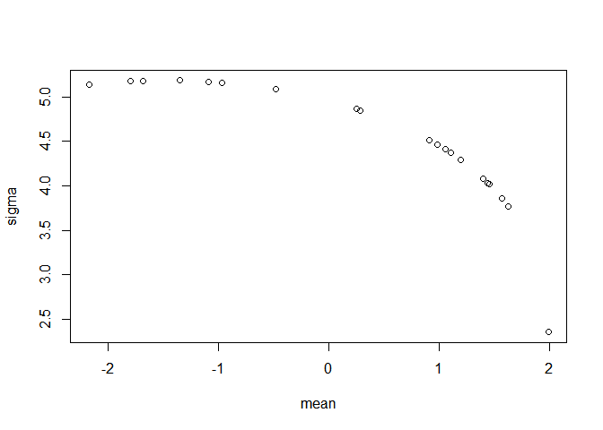
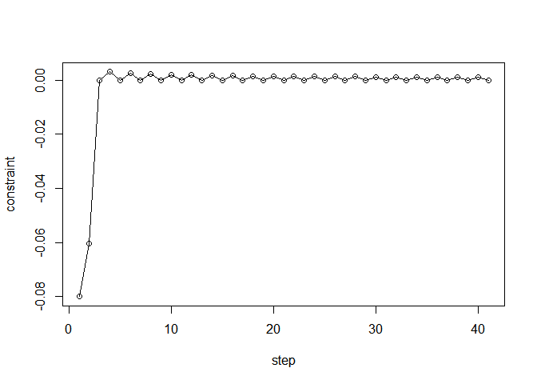
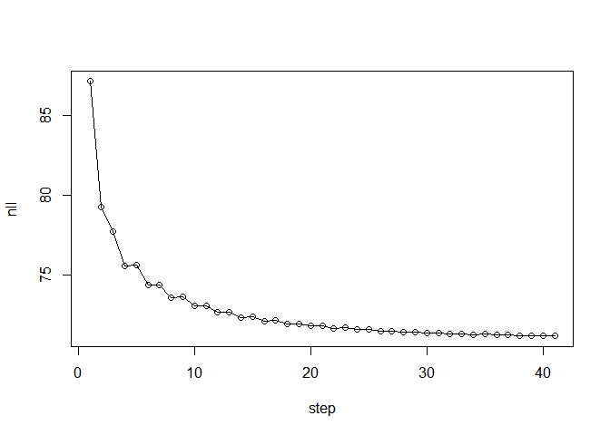
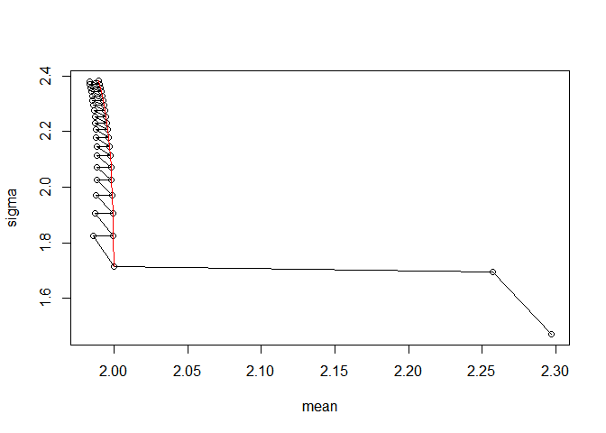

# SolMfd: Algorithms for a solution manifold

## Intended use of the package

Solution manifold is a mathematical concept that can be applied to
various statistical applications. This package aims to provide the
useful functions to utilize solution manifold algorithms. It is consists
of three functions. First one is sampling points from the solution
manifold (sol\_mfd\_points), second one is solving constraint likelihood
estimation problem (constraint\_likelihood), and the last one is
calculating posterior density on solution manifold
(post\_density\_solmfd). More statistical applications, such as integral
estimation or solving density ridge problems, could be implemented in a
later version.

## Installation Instructions

-   Installing from github (currently available):

``` r
# install.packages("devtools")
devtools::install_github("wldyddl5510/SolMfd")

# # If you need vignettes ...
# install.packages(c("knitr", "formatR"))
# devtools::install_github("wldyddl5510/SolMfd", build_vignettes = T)
```

-   Installing from CRAN (not implemented yet):

``` r
# install.packages("SolMfd")
```

## Examples

``` r
library(SolMfd)
set.seed(10) # for consistency
N = 20
# define a target function
phi = function(x) {return(pnorm(2, x[[1]], x[[2]]) - pnorm(-5, x[[1]], x[[2]]) - 0.5)}
d = 2
s = 1
# sampling points from sol_mfd
# using gaussian prior
res_point = sol_mfd_points(N, phi, d, s, gamma = 0.1, prior = "gaussian", mean = c(0, 3), sigma = matrix(c(1, 0.25, 0.25, 1), 2, 2))
res_point_tmp = res_point
# check close to 0
head(apply(res_point_tmp, 1, phi)) # are they on solution manifold? 
```

    ## [1] 1.829297e-06 1.911244e-06 1.838233e-06 1.909537e-06 1.910859e-06
    ## [6] 1.750190e-06

``` r
plot(res_point, xlab = "mean", ylab = "sigma") # how they are distributed
```

<!-- -->

``` r
# constraint likelihood
# num of samples
n = 30
# data distribution
X = rnorm(n, mean = 1.5, sd = 3)
# negative log likelihood
nll = function(theta) {return(-sum(dnorm(X, theta[[1]], theta[[2]], log = TRUE)))}
# constraint
C = function(x) {return(pnorm(2, x[[1]], x[[2]]) - pnorm(-5, x[[1]], x[[2]]) - 0.5)}
theta = runif(2, 1, 3)
theta_updated = constraint_likelihood(nll, C, theta, 1)
# plot the convergences
const_val = apply(theta_updated, 1, C)
plot(x = seq(1, nrow(theta_updated)), const_val, xlab = "step", ylab = "constraint", type = 'o')
```

<!-- -->

``` r
nll_val = apply(theta_updated, 1, nll)
plot(x = seq(1, nrow(theta_updated)), nll_val, xlab = "step", ylab = "nll", type = 'o')
```

<!-- -->

``` r
plot(theta_updated, xlab = "mean", ylab = "sigma", type = 'o')
lines(theta_updated[seq(3, nrow(theta_updated), by = 2), ],  col = 'red')
```

<!-- -->

``` r
# posterior density
k = get("dnorm", mode = 'function')
prob_density = function(x, theta) {return(dnorm(x, mean = theta[[1]], sd = theta[[2]]))}
n = 30
X = rnorm(n, 1.5, 3)
res_with_density = post_density_solmfd(X, prob_density, res_point, k)
```

    ## [1] "No mean declaration. Set to default 0."
    ## [1] "No sigma declaration. Set to default identity matrix."

``` r
res_with_density
```

    ##  [1] 1.324420e-39 2.250786e-44 9.871991e-40 1.304963e-43 2.913336e-45
    ##  [6] 9.838180e-39 2.582961e-41 3.963679e-38 1.187985e-42 1.483367e-38
    ## [11] 1.357034e-38 2.351151e-39 7.633852e-44 3.003671e-41 6.804126e-40
    ## [16] 5.250666e-46 6.775086e-38 4.897395e-45 3.465750e-36 4.447488e-40

## Reference

-   SOLUTION MANIFOLD AND ITS STATISTICAL APPLICATIONS (Yen-Chi
    Chen, 2020)
